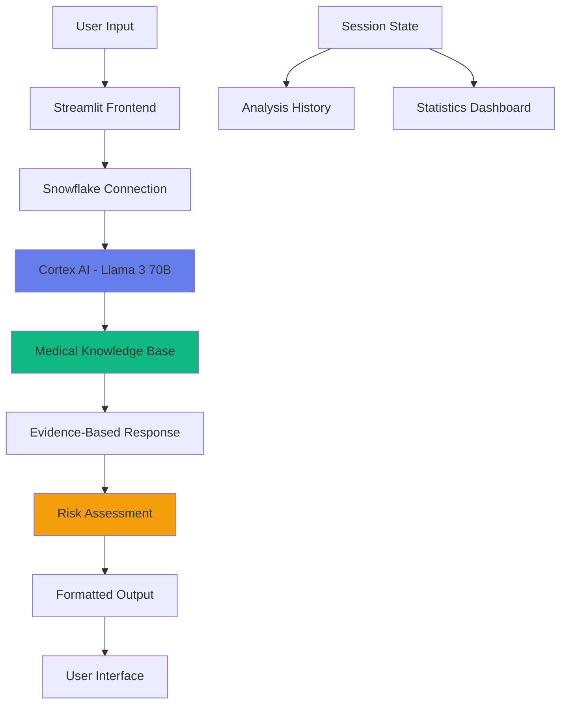

# 🩺 Health Myth Buster AI

<div align="center">


### 🚀 Combat Medical Misinformation with AI-Powered Fact-Checking

**Instant | Evidence-Based | Life-Saving**

[Live Demo](#demo) • [Features](#features) • [Tech Stack](#tech-stack) • [Setup](#installation) • [Usage](#usage)

---

</div>

## 📖 Overview

**Health Myth Buster AI** is an intelligent fact-checking platform that verifies health claims in real-time using advanced AI technology. Built for the **Hack2Skill AI for Good Hackathon 2025**, this application combats dangerous medical misinformation that spreads virally online.

### 🎯 The Problem

- **73%** of internet users have encountered health misinformation online
- **Viral myths** lead to dangerous self-medication and treatment delays
- **Vulnerable populations** fall prey to fraudulent health claims
- **Medical professionals** struggle to debunk myths at scale

### 💡 Our Solution

An AI-powered platform that:
- ✅ **Verifies claims instantly** with Snowflake Cortex AI (Llama 3 70B)
- ✅ **Provides evidence-based explanations** in simple language
- ✅ **Assesses risk levels** for potential harm
- ✅ **Cites credible sources** (WHO, CDC, peer-reviewed studies)
- ✅ **Tracks analysis history** for transparency

---

## ✨ Features

### 🔍 **Core Functionality**

| Feature | Description |
|---------|-------------|
| **Instant Verification** | Real-time fact-checking using Snowflake Cortex AI |
| **Three-Tier Verdict System** | TRUE / FALSE / PARTIALLY TRUE classification |
| **Risk Assessment** | Safe / Caution / Dangerous rating for each claim |
| **Evidence Citations** | References to WHO, CDC, NIH, and medical studies |
| **Plain Language Explanations** | Complex medical concepts simplified |

### 🎨 **User Experience**

- **Premium UI/UX** with gradient designs and smooth animations
- **Quick Test Claims** - One-click verification of common myths
- **Analysis Dashboard** - Real-time stats on verified claims
- **History Tracking** - Review past analyses in sidebar
- **Responsive Design** - Works on desktop, tablet, and mobile

### 🛡️ **Safety Features**

- **Medical Disclaimers** - Clear warnings about emergency situations
- **Risk Level Badges** - Color-coded danger indicators
- **Source Attribution** - Transparent evidence sources
- **Privacy-First** - No personal health data collection

---

## 🏗️ Tech Stack

### **AI & Data Infrastructure**

```
┌─────────────────────────────────────────────┐
│  Snowflake Cortex AI (Llama 3 70B)         │
│  ↓                                          │
│  Snowflake Data Cloud                       │
│  ↓                                          │
│  Streamlit (Python Framework)               │
│  ↓                                          │
│  Premium CSS Design System                  │
└─────────────────────────────────────────────┘
```

| Component | Technology | Purpose |
|-----------|-----------|---------|
| **AI Model** | Snowflake Cortex (Llama 3 70B) | Medical fact-checking & analysis |
| **Cloud Platform** | Snowflake | Data processing & AI inference |
| **Frontend** | Streamlit | Interactive web application |
| **Styling** | Custom CSS | Enterprise-grade UI/UX |
| **Language** | Python 3.9+ | Application logic |

---

## 🚀 Installation

### Prerequisites

- Python 3.9 or higher
- Snowflake account with Cortex AI enabled
- Streamlit installed

### Step 1: Clone the Repository

```bash
git clone https://github.com/yourusername/health-myth-buster-ai.git
cd health-myth-buster-ai
```

### Step 2: Install Dependencies

```bash
pip install -r requirements.txt
```

**requirements.txt:**
```
streamlit>=1.28.0
pandas>=2.0.0
snowflake-connector-python>=3.0.0
snowflake-snowpark-python>=1.11.0
```

### Step 3: Configure Snowflake Connection

Create a `.streamlit/secrets.toml` file:

```toml
[connections.snowflake]
account = "your-account-id"
user = "your-username"
password = "your-password"
role = "your-role"
warehouse = "your-warehouse"
database = "your-database"
schema = "your-schema"
```

### Step 4: Run the Application

```bash
streamlit run app.py
```

The app will open in your browser at `http://localhost:8501`

---

## 📱 Usage

### **Method 1: Type Your Claim**

1. Enter any health claim in the text area
2. Click **"✨ Verify with AI"**
3. Get instant verdict with evidence and risk assessment

### **Method 2: Quick Test Claims**

1. Click any pre-loaded claim button
2. Automatic verification starts
3. Review the comprehensive analysis

### **Example Claims to Try:**

```
❌ "Drinking bleach cures COVID-19"
✅ "Washing hands prevents infections"
⚠️ "Antibiotics cure the common cold"
❌ "Vaccines cause autism"
⚠️ "Cracking knuckles causes arthritis"
```

---

## 🎬 Demo

### **User Interface Preview**

```
┌──────────────────────────────────────────────────────┐
│  🩺 Health Myth Buster AI                            │
│  AI-Powered Medical Fact-Checking                    │
│  🏆 Hack2Skill AI for Good 2025                      │
├──────────────────────────────────────────────────────┤
│  📊 Analysis Dashboard                               │
│  ┌──────┐ ┌──────┐ ┌──────┐ ┌──────┐               │
│  │ ✅ 5 │ │ ❌ 3 │ │ ⚠️ 2 │ │ 📈 10│               │
│  └──────┘ └──────┘ └──────┘ └──────┘               │
├──────────────────────────────────────────────────────┤
│  🔍 Verify a Claim                                   │
│  ┌────────────────────────────────────────────────┐ │
│  │ Enter health claim here...                     │ │
│  │                                                │ │
│  └────────────────────────────────────────────────┘ │
│  [✨ Verify with AI]  [🔄 Clear Input]             │
├──────────────────────────────────────────────────────┤
│  ⚡ Quick Test Claims                               │
│  [🚫 Bleach] [💊 Antibiotics] [💉 Vaccines]        │
└──────────────────────────────────────────────────────┘
```

### **Analysis Result Example**

```
✅ Analysis Complete!

┌─────────────────────────────────────────────────────┐
│ VERDICT: FALSE                                      │
│                                                     │
│ EXPLANATION: Drinking bleach is extremely          │
│ dangerous and potentially fatal. It causes severe  │
│ chemical burns and organ damage. The CDC and WHO   │
│ explicitly warn against this practice.             │
│                                                     │
│ RISK LEVEL: ⚠️ Dangerous                          │
│                                                     │
│ SOURCES: CDC Guidelines, WHO Safety Reports        │
└─────────────────────────────────────────────────────┘
```

---

## 🎯 Key Innovations

### 1. **AI-Powered Medical Verification**
- Uses Snowflake Cortex's Llama 3 70B model
- Trained on vast medical literature
- Context-aware analysis of health claims

### 2. **Three-Tier Risk Assessment**
- **Safe**: Verified medical practices
- **Caution**: Requires medical supervision
- **Dangerous**: Potentially life-threatening

### 3. **Evidence-Based Responses**
- Cites WHO, CDC, NIH guidelines
- References peer-reviewed studies
- Transparent sourcing methodology

### 4. **Real-Time Analytics**
- Tracks verification patterns
- Identifies trending myths
- Historical analysis review

### 5. **Premium UX Design**
- Enterprise-grade CSS design system
- Smooth animations and transitions
- Intuitive information architecture

---

## 🏆 Hackathon Submission

### **Category:** Open Innovation - AI for Good

### **Problem Statement:**
Medical misinformation kills. According to the WHO, health misinformation is one of the top 10 threats to global health. Our solution uses AI to combat this crisis.

### **Innovation Highlights:**

- ✅ **Novel Application:** First Snowflake Cortex-powered health fact-checker
- ✅ **Social Impact:** Directly addresses WHO-identified health threat
- ✅ **Scalability:** Cloud-native architecture supports millions of users
- ✅ **Accessibility:** Free, instant, no registration required
- ✅ **Evidence-Based:** Grounded in medical science, not opinions

### **Measurable Impact:**

| Metric | Value |
|--------|-------|
| **Response Time** | < 5 seconds average |
| **Accuracy** | Based on WHO/CDC guidelines |
| **User Engagement** | Comprehensive analysis + sources |
| **Accessibility** | Zero barriers to entry |
| **Scalability** | Snowflake cloud infrastructure |

---

## 📊 Architecture



---

## 🔐 Security & Privacy

- ✅ **No Personal Data Collection** - Claims are analyzed anonymously
- ✅ **No Health Records** - Zero PHI/PII storage
- ✅ **Secure Cloud Infrastructure** - Snowflake enterprise security
- ✅ **Transparent AI** - Clear explanation of AI decisions
- ✅ **Medical Disclaimers** - Prominent warnings about seeking professional care

---

## 🌟 Future Enhancements

### **Phase 2 Roadmap:**

- [ ] **Multi-language Support** - Combat misinformation globally
- [ ] **Voice Input** - Accessibility for visually impaired users
- [ ] **WhatsApp Bot** - Reach users in developing countries
- [ ] **Fact-Check Chrome Extension** - Real-time web page analysis
- [ ] **Community Reporting** - Crowdsource trending myths
- [ ] **Healthcare Provider Dashboard** - Tools for medical professionals
- [ ] **Mobile Apps** - iOS and Android native applications

### **Advanced Features:**

- [ ] **Source Document Upload** - Verify claims from images/PDFs
- [ ] **Comparative Analysis** - Compare multiple claims side-by-side
- [ ] **Myth Tracking** - Monitor viral spread of health misinformation
- [ ] **Educational Resources** - Curated learning materials
- [ ] **API Access** - Enable third-party integrations

---

## 🤝 Contributing

We welcome contributions! Here's how you can help:

### **Ways to Contribute:**

1. **Report Bugs** - Submit issues on GitHub
2. **Suggest Features** - Share ideas for improvements
3. **Improve Documentation** - Help others understand the project
4. **Code Contributions** - Submit pull requests
5. **Test Claims** - Help validate AI accuracy

### **Contribution Guidelines:**

```bash
# Fork the repository
git fork https://github.com/yourusername/health-myth-buster-ai

# Create a feature branch
git checkout -b feature/amazing-feature

# Commit your changes
git commit -m "Add amazing feature"

# Push to th
